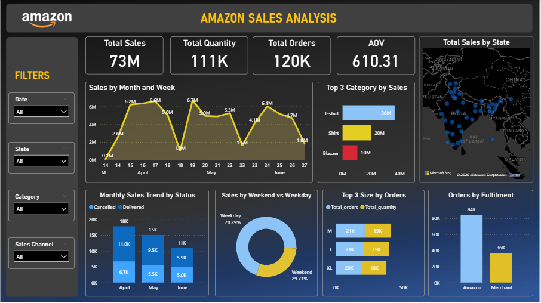

# Amazon Sales Analysis
**Project done as part of my internship at [InnoByte Services](#)** 

## Overview
This project analyzes Amazon sales data to uncover trends, top-performing products, States and Citys. The goal is to provide actionable insights for improving sales strategies, inventory, and operations.

## Dataset
- **Columns:** Order ID, Product Category, Size, Sales Channel, Fulfillment, fulfilled by, Customer Type (B2B/B2C), Order Status, Sales Quantity, Revenue, City, State, Order Date  
- **Business Context:** Dataset contains Amazon orders, including product details, fulfillment info, and sales performance across States and Citys.

## Key Insights
- T-shirts and Shirts are top-selling, with T-shirts generating the highest revenue.  
- Sizes M, L, XL are most preferred and most profitable.  
- Amazon fulfills most orders, primarily B2C; B2B sales are minimal (0.7%).  
- Bengaluru, Hyderabad, Mumbai are top-performing cities; Maharashtra & Karnataka lead at state level.  
- Weekday sales are higher than weekends, with periodic fluctuations.

## Recommendations
- Prioritize inventory for high-demand products and sizes.  
- Optimize Amazon fulfillment to reduce cancellations.  
- Target promotions in top cities and states.  
- Leverage weekday trends for sales campaigns.  
- Explore strategies to boost B2B sales.

## Tools & Technologies
Python (Pandas, Matplotlib, Seaborn), Jupyter Notebook, Excel, Power BI.

### Screenshots / Demos
**Show what the dashboard looks like 
